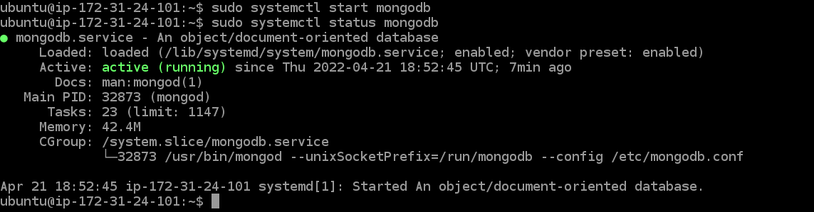
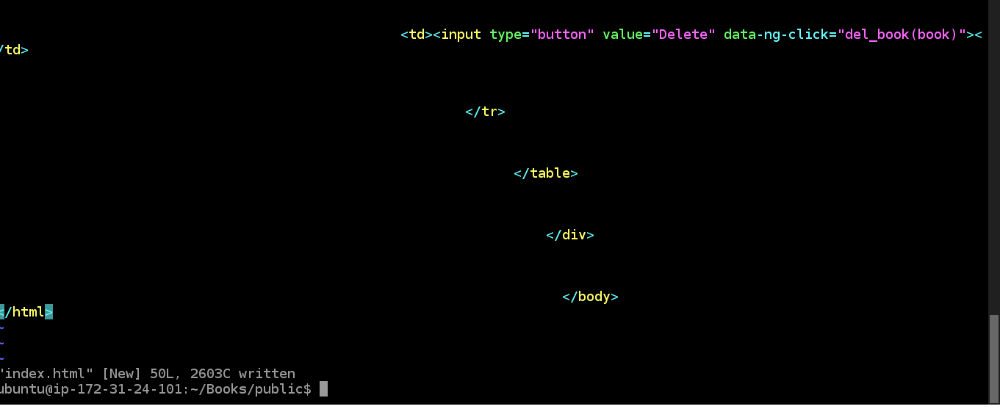

# Documentation of project 4
## Step 1

a. I updated ubuntu
    `sudo apt update`
    

b. I upgraded ubuntu
   `sudo apt upgrade`
    

c. I added certificates
    `sudo apt -y install curl dirmngr apt-transport-https lsb-release ca-certificates`

    `curl -sL https://deb.nodesource.com/setup_12.x | sudo -E bash -`
    
d. I installed NodeJS
   `sudo apt install -y nodejs`
   

## Step 2
a. I added the key-server
     `sudo apt-key adv --keyserver hkp://keyserver.ubuntu.com:80 --recv 0C49F3730359A14518585931BC711F9BA15703C6`
    

b.    `echo "deb [ arch=amd64 ] https://repo.mongodb.org/apt/ubuntu trusty/mongodb-org/3.4 multiverse" | sudo tee /etc/apt/sources.list.d/mongodb-org-3.4.list`
       

c.  I installed mongoDB
     `sudo apt install -y mongodb`
     

d.  I started the server and I checked the status
       `sudo service mongodb start`
       `sudo systemctl status mongodb`
       

e.  I installed NPM
        `sudo apt install -y npm`
        

f.   I installed body-parser
        `sudo npm install body-parser`
        

g.   I created a folder named 'Books'
         `mkdir Books && cd Books`
         

h.   I initialized the NPM
          `npm init`
           

g.   I added a file named 'server.js' to the Books directory, then I copied and pasted the appropriate code in it.
          `vi server.js`
           

## Step 3
a.   Install Xpress mongoose
         `sudo npm install express mongoose`
          

b.   I created a folder named "apps"
       `mkdir apps && cd apps`
       

c.   I created a file named "routes.js", then I copied and pasted the appropriate code in it.
       `vi routes.js`
        

d.  I created a folder named 'models' in the apps directory
     `mkdir models && cd models`
     

e.  I created a file named 'book.js', then I copied and pasted the appropriate code in it.
     `vi book.js`
      

## Step 4
a.  I changed the directory back to 'Books', then I created a folder named "public"
      `cd ../..` `mkdir public && cd public`
      

b.  I added a file named "script.js" then I copied and pasted the appropriate code in it
    `vi script.js`
    

c.  I created a file in the public folder and named it "index.html". Then I copied and pasted the appropriate code in it.
     `vi index.html`
     

d.  I changed the directory back to 'Books'
     `cd ..`
      

e.  I started the node server
      `node server.js`
      

f.   I launched a separate SSH console to test what the 'curl' command returns locally
      `curl -s http://localhost:3300`
      

g.  I launched my public address on my preferred web browser
      `http://184.73.9.165:3300/`
      

        

